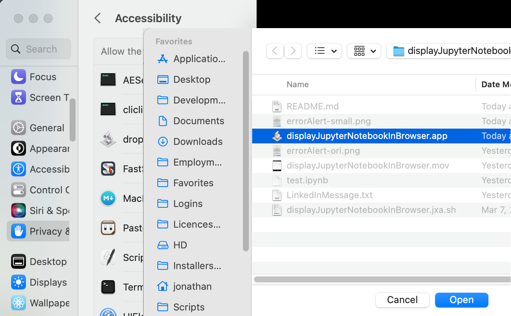

# displayJupyterNotebookInBrowser.app
Automatically open ".ipynb" Jupyter notebooks in Google Chrome by double-clicking them.
## Requirements:
- macOS, OS X Yosemite or newer
- Terminal.app, including sh or bash
- Apple's Script Editor
- the Google Chrome browser
- The Anaconda python distribution

## Installation:
- Download and install the Anaconda package from [https://www.anaconda.com](https://www.anaconda.com).
- Configure Jupyter Notebooks:
 - In a Terminal window, run the command
 `jupyter-notebook --generate-config`

 This will create a directory`.jupyter`in your home folder; in this directory will be a file`jupyter_notebook_config.py.`
 - In this file, edit the line "`# c.NotebookApp.browser = ''`": Remove the `#` and change`''`to `'open -a /path/to/your/browser.app %s'`.
- Download `displayJupyterNotebookInBrowser.app` and `displayJupyterNotebookInBrowser.jxa.sh` from this repository. Move them to appropriate folders (`~/Library/Scripts` and `~/bin`, for example.)
- Using the Script Editor, edit the last line of `displayJupyterNotebookInBrowser.app` to contain the appropriate path to `displayJupyterNotebookInBrowser.jxa.sh.`
- Select any Jupyter notebook file (file type `.ipynb`). Enter Command-I to bring up its information window.
- In the "Open With" option, navigate to `displayJupyterNotebookInBrowser.app.`
- Click the "Change All…" button; in the resulting "Are you sure you want to change all similar documents...?" dialog, click Continue. Close the information window.

## Running the Scripts:
- Double-click any .ipynb file to display it in a Google Chrome window.

The first time you attempt to open a notebook (or anytime you modify`displayJupyterNotebookInBrowser.app)`you will get an error message, "Error: Error: </path/to/displayJupyterNotebookInBrowser.jxa.sh>: execution error: Error: Error: osascript is not allowed to send keystrokes. (1002)."

Fix this using the Apple Menu's "System Settings" (following directions are for macOS Ventura) as follows:
  - Select Privacy & Security> Accesibility:

  - Click "+" in the righthand panel:

	then add `displayJupyterNotebookInBrowser.app` (not `displayJupyterNotebookInBrowser.jxa.sh).`

	(If`displayJupyterNotebookInBrowser.app`is already showing in this panel, delete it then re-add it.)
  - Confirm your selection in the dialog that follows.

 - A Terminal window will open at the folder of your .ipynb file and run the script "Jupyter notebook." This will cause the folder of your notebook to open in Google Chrome. Your file will show in the window but don't click it—the script will open the notebook for you.